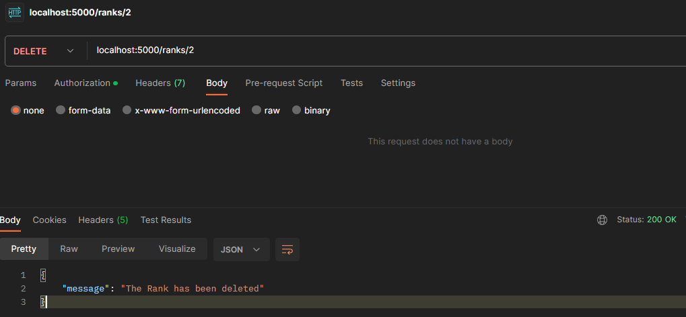
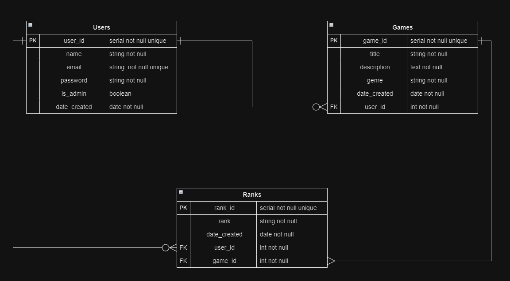

# LachlanPeterson_T2A2

The following document was created by **Lachlan Peterson** in order to fulfill the requirements of ***Coder Academy's*** API Webserver Project **(T2A2)**.

---

## Table of contents
1. [Github Repository](#github-repository)
2. [The Problem my API Solves - (R1)(R2)](#identification-of-the-problem-you-are-trying-to-solve-building-this-particular-app-and-why-it-is-a-problem-that-needs-solving)
3. [Chosen Database System- (R3)](#why-have-you-chosen-this-database-system-what-are-the-drawbacks-compared-to-others)
4. [Endpoints for Competitive Network API - (R5)](#document-all-endpoints-for-your-api)
5. [ERD for my App - (R6)](#erd-for-competitive-network-api)
6. [Database relations to be Implemented - (R9)](#discuss-the-database-relations-to-be-implemented-in-your-application)
7. [Third Party Services - (R7)](#third-party-services-used-by-my-application)
8. [Project Models - (R8)](#describe-your-project-models-in-terms-of-the-relationship-they-will-have-with-eachother)
9. [Task Allocation and Project Planning - (R10)](#describe-the-way-tasks-are-allocated-and-tracked-in-your-project)

---

## Github Repository

The following link will take you to the Github Repo for my API Webserver Project:

[*LachlanPeterson_T2A2 Github Repository*](https://github.com/LachlanPeterson/LachlanPetersonT2A2)

---


## Identification of the problem you are trying to solve building this particular app and why it is a problem that needs solving?

In the current ‘Gaming Landscape’, most gamers interact with each other through various communication applications like Discord and TeamSpeak, whilst also messaging via friends lists on steam (gaming marketplace) or built-in friends list for specific games. These applications often let users see what games their friends are playing, and all the different games they’ve played – but there is no function where you can search someone’s rank across multiple different games. To find someone’s rank in a single game, you are often required to access or play the game yourself, as its available in the client. For example, on the League of Legends client I can view my friends list, view their user profile, and see their competitive rank. However, this is only their League of Legends rank, I’m not even able to view their Valorant rank which is an FPS game also made by RIOT Games. 

Over recent years, there are a few websites tackling this issue on the individual game level to make ranks accessible outside of the game clients. Websites like op.gg track the ranked data for all players in League of Legends and tracker.gg also achieves the same result for Valorant. But the key problem remains, they are only tracking users ranks across one single game. There currently isn’t a website that shows a user’s competitive ranks across multiple different games. If I want to see my friends League of Legends, Counter-Strike and Rocket League ranks I would either need to login to each of these games to view it in their respective clients, or access three different websites. Users may even be on different consoles… or game servers might be old and shut down, so there is a need to archive these competitive ranks. I don’t want to be forced to turn on my Xbox360 to see my friends old Halo 3 rank. There needs to be a designated application for competitive games to access this information. The problem currently is that there is no efficient, fast, or intuitive way to view competitive ranks across multiple games for specific users.

Therefore, the following application aims to solve this problem. Competitive Network – as the name suggests – is an API webserver that allows users to network, by searching through lists of games, users and ranks on a relational database. In its current form, the API functionality allows users to find the ranks of all players for a given game, and importantly lookup a specific user to find the competitive rank of every game they play. Thus, solving the problem by creating a centralised database of user ranks across multiple games. 

In future updates I plan to build upon this solution further and create a social network add-on, so this API can have a friends list and users can message each other and connect. This would mean that not only do users have a platform where they can access the ranks of their friends across all the games they play, but also have a social network for competitive gamers, rather than just a database of information. 

<br>

[*Back to Top*](#lachlanpeterson_t2a2)

---

## Why have you chosen this database system. What are the drawbacks compared to others?

To fulfill the requirements of the API Webserver Project, I have implemented PostgreSQL as the chosen database management system for the following reasons. 

PostgreSQL is an open source, enterprise class relational database, which gives me the freedom to implement, use and modify the database for free during the lifespan of this project without any licensing cost or overheads. Open source software also comes with the benefit of a thriving community of support, which allows for ‘crowd-funded’ solutions (help) and easier maintenance throughout the project life cycle and beyond. This is also partially due to its popularity, as it’s supported on all major operating systems – Windows, Mac and Linux -  and also supports most leading programming languages like Java, C++ and in the case of this project, Python. 

PostgreSQL also offers great flexibility when building an application, because it allows for both SQL (relational) and JSON (non-relational) querying. Importantly for our project, it also supports the use of foreign keys and includes most datatypes in SQL (i.e., Boolean, Numeric, Integer, Date, Interval etc.). When starting out an API Webserver Project, the amount of data it holds and concurrent users will likely be small at first, however there is a chance it gains popularity in the future. PostgreSQL was chosen with this in mind, due to its scalability.

Unfortunately, there are some potential drawbacks to using an open source database that must be considered. For example, because its an open source database, there is a lack of ‘official’ support when troubleshooting complex issues. In conjunction with a steep learning curve, this can make some aspects of development harder than when using other database systems (i.e. security risks and compatibility changes). Also, when compared to other database systems like MySQL, its performance is slower as it uses more memory than a typical DBMS.   

However, even after presenting the drawbacks I still believe that postgreSQL is ultimately well suited for the proposed API Webserver Project - due to its reliability, the robustness of its features and because it’s a free enterprise class relational database.   

<br>

[*Back to Top*](#lachlanpeterson_t2a2)

---

## Document all endpoints for your API

## AUTH Routes:

### Route: auth/register
**HTTP Request verb:** POST  
**Arguments:** None  
**Authentication:** No Authentication is required, as this route handles new users who aren't in the system.  
**Required Data:** Name, Email and Password  
**Description:** This route is designed to allow new users to register to our API and creates a new user the database. When all conditions are met the user details will be returned to the user, excluding the password (for security reasons). 

Successful registration (conditions are met):


If the conditions are not met - the user is missing a required field, or if the email address is already registered - users will be presented with the following error messages:


<br>

### Route: auth/login
**HTTP Request verb:** POST  
**Arguments:** None  
**Authentication:** If a user login is successful, an JWT token will be generated and attached to the user_id for future authentication/verification uses.   
**Required Data:** Email and Password    
**Description:** The route allows users who have already registered to login, and generates a unique access token which is required when using certain functions of the API. Some features will accept any access token (users to be logged in) to access a route, whereas some routes will only accept unique tokens (owner or admin). For example, if a user wants to create a new competitive rank, they will have to be logged in and can only create a rank for their own account.  


Successful Login (As only the email and password are required you can login with or without it):


If the conditions are not met - the user is missing a required fields, or the email address or password is invalid (wrong) - users will be presented with the following error messages:


<br>

## GAMES Routes:

### Route: /games
**HTTP Request verb:** POST  
**Arguments:** None  
**Authentication:** Users must be logged in (authenticated with their access token) and an admin (authorised user) to use this endpoints functionality.
**Required Data:** Only a Title is required, however if a genre is provided it must be a valid gaming genre otherwise the admin user will be prompted by an error. 
**Description:** The route allows admins to create new games for the database, and when all conditions are met it outputs the Game details and the admin user who created it. The genre and description for games do not have to be entered as they have default values. 

Successful POST examples:


If the conditions are not met - the user is not an admin, the using is missing the title field, or the genre is invalid - admins will be presented with the following error messages:


<br>

### Route: /games
**HTTP Request verb:** GET  
**Arguments:** None  
**Authentication:** No Authentication is required, as this route handles new users who aren't in the system. 
**Required Data:** None
**Description:** The route allows anyone (non-user or users) to access and read the list of all games in the database. It outputs the details of the games in the database without ranks and users. 

Successful GET:


<br>

### Route: /games/< int:game_id>
**HTTP Request verb:** GET    
**Arguments:** The integer of the game_id needs to first be retrieved from the database. In the successful example below, I need to know that League of Legends has a game_id of 1, therefore allowing me to do a GET request on '/games/1' to return information for League of Legends.    
**Authentication:** Users must be logged in (authenticated with their access token).    
**Required Data:** None  
**Description:** The route allows authenticated logged in users (regular or admins) to view the details of a specific game and see ALL user ranks for that game and the admin who created it. 

Successful GET:


If the conditions are not met - the user is not logged in, or the game_id is not found - users will be presented with the following error messages:


<br>

### Route: /games/< int:game_id>
**HTTP Request verb:** PUT, PATCH    
**Arguments:** The integer of the game_id needs to be retrieved.      
**Authentication:** Users must be logged in (authenticated with their access token) and an admin (authorised user) to use this endpoints functionality.  
**Required Data:** None, you are able to update any or all of the columns at once.   
**Description:** The route allows authenticated logged in admins to update the a games details in the database. Upon successful completion, the updated game details will be shown. 

Successful PUT/PATCH:


If the conditions are not met - the user is not an admin, or the game_id is not found - users will be presented with the following error messages:


<br>

### Route: /games/< int:game_id>
**HTTP Request verb:** DELETE    
**Arguments:** The integer of the game_id needs to be retrieved.      
**Authentication:** Users must be logged in (authenticated with their access token) and an admin (authorised user) to use this endpoints functionality.  
**Required Data:** None.
**Description:** The route allows authenticated logged in admins delete a games from the database. Upon successful completion, the admin will receive a deleted message.

Successful PUT/PATCH:


If the conditions are not met - the user is not an admin, or the game_id is not found - users will be presented with the following error messages:


<br>

## USERS Routes:

### Route: /users
**HTTP Request verb:** GET  
**Arguments:** None  
**Authentication:** Users must be logged in (authenticated with their access token).
**Required Data:** None. 
**Description:** This route allows any logged in user to access a list of all other users in the database. If successful, the user details including name, email, user_id and is_admin will be returned. 

Successful GET:


If the conditions are not met - the user is not logged in - users will be presented with the following error messages:


<br>

### Route: /users/< int:user_id>
**HTTP Request verb:** GET  
**Arguments:** The integer of the user_id needs to be retrieved. 
**Authentication:** Users must be logged in (authenticated with their access token).
**Required Data:** None. 
**Description:** This route allows any logged in user to access a specific users details, which shows all each Game and Rank of the individual user. This is a very important route and it solves the inital problem of why this API was built, to be able to look up specific users and see their ranks across all games they play.  

Successful GET:


If the conditions are not met - the user is not logged in, or the user_id doesnt exist - users will be presented with the following error messages:


<br>

### Route: /users/< int:user_id>
**HTTP Request verb:** PUT, PATCH 
**Arguments:** The integer of the user_id needs to be retrieved. 
**Authentication:** Users must be logged in (authenticated with their access token) and an admin (authorised user) to use this endpoints functionality.
**Required Data:** None. 
**Description:** This route allows admins to update the name, email or password of any user in the database. 

Successful GET:


If the conditions are not met - the user is not logged in, not an admin or the user is not found - admins will be presented with the following error messages:


<br>

### Route: /users/< int:user_id>
**HTTP Request verb:** DELETE
**Arguments:** The integer of the user_id needs to be retrieved. 
**Authentication:** Users must be logged in (authenticated with their access token) and an admin (authorised user) to use this endpoints functionality.
**Required Data:** None. 
**Description:** The route allows authenticated logged in admins delete a user from the database. The users ranks and game details will also be deleted. Upon successful completion, the admin will receive a deleted message.

Successful GET:


If the conditions are not met - the user is not logged in, not an admin or the user is not found - admins will be presented with the following error messages:


<br>

## RANKS Routes:

### Route: /ranks
**HTTP Request verb:** GET  
**Arguments:** None  
**Authentication:** Users must be logged in (authenticated with their access token).
**Required Data:** None. 
**Description:** This route allows any logged in user to access a list of all ranks accross all games - based on the time it was created. Therefore the list it outputs will show the latest rank added in the database.

Successful POST:


If the conditions are not met - the user is not logged in - users will be presented with the following error messages:


<br>

### Route: /ranks/< int:rank_id>
**HTTP Request verb:** GET  
**Arguments:** The integer of the rank_id needs to be retrieved. 
**Authentication:** Users must be logged in (authenticated with their access token).
**Required Data:** None. 
**Description:** This route allows any logged in user to access a specific rank_id, showing the game it was achieved in, the overall rank and the user.

Successful POST:


If the conditions are not met - the user is not logged in - users will be presented with the following error messages:


<br>

### Route: /ranks/< int:rank_id>
**HTTP Request verb:** PUT, PATCH  
**Arguments:** The integer of the user_id needs to be retrieved. 
**Authentication:** Users must be logged in (authenticated with their access token) and an admin (authorised user) to use this endpoints functionality.
**Required Data:** None. 
**Description:** This route allows an admin to update ranked details for specific users.

Successful POST:


If the conditions are not met - the user is not logged in, not an admin, or the rank_id cannot be found - users will be presented with the following error messages:


<br>

### Route: /ranks/< int:rank_id>
**HTTP Request verb:** DELETE 
**Arguments:** The integer of the user_id needs to be retrieved. 
**Authentication:** Users must be logged in (authenticated with their access token) and an admin (authorised user) to use this endpoints functionality.
**Required Data:** None. 
**Description:** This route allows an admin to delete a users existing rank from a game. This could be used to delete ranks from a user found to be cheating. 

Successful POST:


If the conditions are not met - the user is not logged in, not an admin, or the rank_id cannot be found - users will be presented with the following error messages:


<br>

[*Back to Top*](#lachlanpeterson_t2a2)

---

## ERD for Competitive Network API



<br>

[*Back to Top*](#lachlanpeterson_t2a2)

---

## Discuss the database relations to be implemented in your application

As seen in the ERD for the Competitive Network API, the project database will consist of 3 main entities: Users, Games and Ranks. 

### Users
The Users entity table provides important information for each user, detailing their name, email (must be unique), password, whether they are an admin and finally the date the user was created. Additionally, the table has the Primary Key - ‘user_id’ - to serve as a unique identification when interacting and forming relations with other entities. This user_id is the most vital form of identification in the proposed API, as the goal is to view competitive **ranks** across multiple **games** for individual **users**.  It is important to note that the email address must also be unique (since they are unique across the web) and is used during user registration to stop duplicate users. 

### Games
The Games entity table provides information regarding each game in the database, outlining the title, description, genre, date it was created and the user_id listed as a foreign key. The primary function of this entity is to provide the data on multiple games within our API database and allows users to have a list of all games they have ranks in. 

### Ranks
The Ranks entity table is made up of a unique rank_id (primary key), rank (users rank), the date it was created and both the user_id and game_id as foreign keys respectively. It was important to setup this entity in the database like this, as unique users need to be able to display their personal ranks for any given game. 


### Relationships
From the ERD relations outlined by the Crow’s Foot Notation, the Users entity has a ‘Zero or Many’ relationship with both Games and Ranks. This is because when a user initially registers and logs into the API, they may have not entered any ranks into the system or played the competitive games that are listed in the system. However, once they view a list of the available games in the database and play any game to then input a rank, they will have many games and ranks attached to their unique user_id in the database. Because of this, the relationship from games and ranks to users are both ‘One’ respectively, as all games and ranks are attached to specific users. This is further reflected in the ERD, as user_id is listed as a foreign key in both the Games and Ranks entity. 

The remaining two relationships exist between the Games and Ranks entity. Each game may consist of many ranks – bronze, silver, gold, diamond, master – however these ranks are from a one game, as represented in the Ranks entity as a foreign key under game_id. Therefore, the relationship from Ranks to Games is ‘One’ as you can only have one rank showing per game for each user. The final relationship as shown in the ERD is Games to Ranks, which is represented as One to 'Many'. The relationship arises as if you have played the game you will have one rank, however it can also be updated or changed in the future. 

In summary, the relations between the database entities are as follows:
- Users to Games = 'Zero or Many'
- Users to Ranks = 'Zero or Many'
- Games to Users = 'One'
- Ranks to Users = 'One'
- Ranks to Games = 'One'
- Games to Ranks = 'One to Many'

<br>

[*Back to Top*](#lachlanpeterson_t2a2)

---

## Third Party Services used by my application

### PostgreSQL:
PostgreSQL is a flexible open source, enterprise class relational database that allows for both SQL (relational) and JSON (non-relational) querying. It is a reliable and robust database management system that supports the use of foreign keys and allows for great scalability of projects – like the current API Webserver Project. 


### Flask:
Flask is a micro web framework that is used for developing web applications in Python. It enables users to build RESTful APIs like this current project – due to its diverse functionality. It allows web servers to pass requests (HTTP requests) to web applications and lets users create URL routes. It comes with great in-built features - like the developer server and fast debugger – but also has additional functionality when packages are added i.e., authentication, encryption and ORM mapping. Flask is designed to be lightweight and supports modular programming. This is pivotal in building APIs, as each module can be built and function individually before being applied on an app wide scale, making it easy to test while providing a flexible and movable structure.   

### SQLAlchemy
SQLAlchemy is a popular database toolkit and ORM that allows developers to connect and manage SQL databases – PostgreSQL in the case of the Competitive Network API - in Python. It lets developers create tables, by passing in database models through a class, and run SQL queries by calling a method on these classes. Simplistically it gives an application and its users the ability to connect with a database and process raw SQL queries in Python.  

### Marshmallow
Marshmallow is an object serialization and deserialization library used in Python, that formats data to and from python data types – in the case of this application JSON. When used in conjunction with flask (flask-marshmallow) and Python, Marshmallow schemas have many great features. For example, they can correctly handle data requests and responses for APIs, validate and format input data, and serialize and render objects to JSON.

### Bcrypt
Bcrypt is a password hashing function that can be utilized in APIs as an extension to Flask – In the Competitive Network API Flask-Bcrypt was implemented. Bcrypt is used to encrypt and store user passwords by transforming the plain text to a fixed-length hash value. While this may appear as random, the  hashing function will always produce the same output when given the same input string. It is intentionally made to be slow and assigns a random value to the original password string before hashing it, thus allowing for the addition of extra layers of security to an application. Ultimately, it is being used to protect passwords in the application.

### Flask-JWT-Extended
As the name suggests, the Flask JWT Extended library is an additional library for JWT Manger used to implement JSON Web Tokens (JWT) for authentication purposes in the API. Overall, this third-party service allows developers to manage, create, store, and validate JWTs. Once a JWT secret key has been configured in the application, Flask-JWT-Extended can be used to create JSON Web Tokens using ‘‘create_access_token()’, protect specific routes by requiring a valid JWT using ‘jwt_required()’, and get the identity of a JWT in a protected route using ‘get_jwt_identity()’.

In the Competitive Network API, I’ve used these functions to setup admin only routes and routes that required users to be logged in with a valid JWT. For users to access a jwt_required route, the JWT is required as the Bearer Token in the Authorization header when sending each request. An example of this generated token can be seen below when logging in to the API:


Therefore, a user can now use this token when sending a request rather than logging into the API for every request as the Bearer Token:


### Psycopg2 

Psycopg2 has been used in the Competitive Network API as an adaptor for Python, that enables the PostgreSQL database and flask application to connect and specifically allows SQLAlchemy to interact with the database.  


<br>

[*Back to Top*](#lachlanpeterson_t2a2)

---

## Describe your project Models in terms of the relationship they will have with eachother

### User Model:
The User model is the parent model of the 3 different entities in the database. The class User models the database columns as outlined in the screenshot below. It contains a user_id (primary key), name, email, password, is_admin (Boolean) and a date created. The relationship between games and ranks can also be seen as they are both children of user as determined by the user_id foreign key in each of their user models respectively. Therefore, if a user was to be deleted, their synchronized games and ranks data will also need to be deleted as shown by the (cascade=’all, delete’).  

The UserSchema is used to convert these data types in database readable format via the ma.schema so that when it is retrieved we will get the desired fields in JSON. Given the relationship of users to both games and ranks, we also want to retrieve fields from their individual Schemas. As shown in the image, we are retrieving both the Game and Rank Schema and excluding the user fields and respective primary keys (game_id and rank_id). 

Finally, the subclass Meta: will return the desired fields listed as JSON if we return UserSchema as a dump passing in user/s. 

```python
Return UserSchema.dump(user)
```
The User Model can be viewed below:


### Ranks Model:
The database columns for the Rank Model are outlined in the screenshot below. They contain rank_id (primary key), rank, date_created, user_id (foreign key) and game_id (foreign key). The relationship between Ranks and the other two entities can be seen as it includes the two foreign keys from each model respectively. Therefore, the relationship between Ranks to both Users and Games is One, as each rank must be associated with one specific user and game respectively. Thus, it is reflected in its db. relationship as a child to both the User and Game model and will not delete the related user or game if it is deleted. 

The RankSchema is used to convert these data types in database readable format via the ma.schema so that when it is retrieved we will get the desired fields in JSON. When outputting the JSON fields, we also want to retrieve the name and email from the UserSchema, along with the title and genre from the GameSchema. This will result in the subclass Meta returning the following fields as a JSON when the RankSchema is returned as a dump via rank/s: rank_id, rank, date_created, user and game. This coincides with the purpose of the model, as when retrieving our rank model, we also get to see the specific user to captured rank is and the game it relates too. 

```python
Return RankSchema.dump(rank)
```


### Games Model:
The database columns for the Game Model are outlined in the screenshot below. The model contains the following columns in the games table: game_id (primary key), title, description, genre, date_created and user_id (foreign key). As mentioned previously in the User model, the games model is indeed a child of User, and if it is deleted it will not delete the related user. However, as shown by the db.relationship it is a parent of Rank. This is because a given rank can only relate to ‘One’ game, and games can have ‘One to Many’ ranks. Therefore, if a game is deleted from a specific user, then the corresponding rank that user had in the game must also be deleted… as reflected by the cascade ='all, delete'.

The GameSchema is used to convert these data types in database readable format via the ma.schema so that when it is retrieved we will get the desired fields in JSON. As shown in the code, we are also wanting to return specific fields from the UserSchema and RankSchema when we output our GameSchema. We have also included some validation on title and genre in the GameSchema, such that there is a fixed length between 3-50 characters in the title (only containing letters, numbers, and spaces), and genre must be given a default genre from the VALID_GENRES list if none is provided upon Game creation. Finally, the subclass Meta will return the following fields as a JSON output when the GameSchema is returned as a dump via game/s: game_id, title, description, genre, user, ranks. This makes sense given the scope of the project, as when we output our GameSchema fields, we want to see all the ranks from users for any given game.

```python
Return GameSchema.dump(game)
```


<br>

[*Back to Top*](#lachlanpeterson_t2a2)

---


## Describe the way tasks are allocated and tracked in your project

Before allocating tasks for coding, the project had to first be planned so that I would accurately fulfil the requirements for the API Webserver Project. The problem I am trying to combat is that in the current ‘Gaming Landscape’, there is no way to view competitive ranks for users across MULTIPLE games. For instance, If I want to lookup my friends League of Legends, Valorant and Counter Strike rank, I am unable to go to one database or location to find it. Instead, I will need to access 3 different game clients or websites that show users ranks for that specific game. 

Thus, the planning stage was needed and broken down as follows:
-	Breakdown the problem into entities and discuss the relationship between them (Users, Ranks, Games).
-	Create an entity relationship diagram (ERD) to represents the relationships in the normalised relational database.
-	Choose the ‘best-fit’ database system (PostgreSQL)

The breakdown of the problem was completed after posting the following to the api-app-ideas discord page:


The ERD was created as already seen above in the README.  
[ERD for my App - (R6)](#erd-for-competitive-network-api)

And finally, the best fit database system was choosing after weighing up some potential pros and cons as seen above in the README.  
[Chosen Database System- (R3)](#why-have-you-chosen-this-database-system-what-are-the-drawbacks-compared-to-others)

Once the planning stages were completed, I needed to create a software development plan that tracked and allocated tasks. In order to allocate tasks, I first had to determine what tasks needed to be completed:

- Connect a psql database to my Flask Application
- Create Entity models
- Create Cli commands to create and seed the entity models in my application
- Create seed data for my Entity models
- Test basic SQL functionality to ensure my application is setup correctly
- Added Marshmallow packages in order to create routes
- Create a Register and Login Route
- Implement JWT Authentication
- Setup my .env and .envsample
- Modularize my Entities
    - Users, Games, Ranks
- Make sure my application is refactored by using blueprints
- Make sure all Entities are CRUD
    -  Users, Games, Ranks
- Catch any errors and return appropriate messages
- Add db.relationships to each Model
- Comment the code where necessary to explain queries.
- Further route testing and screenshots for README endpoints. 

These tasks are tracked via Git commits and electronically in Microsoft Excel. The completion of tasks was shown by the colour fill next to the task: 
- Red = Not started,
- Yellows = In-Progess,
- Green = Completed

The task tracking is shown below, but the completed colours have been altered to give an example of each status:

  I 

<br>

[*Back to Top*](#lachlanpeterson_t2a2)

---
